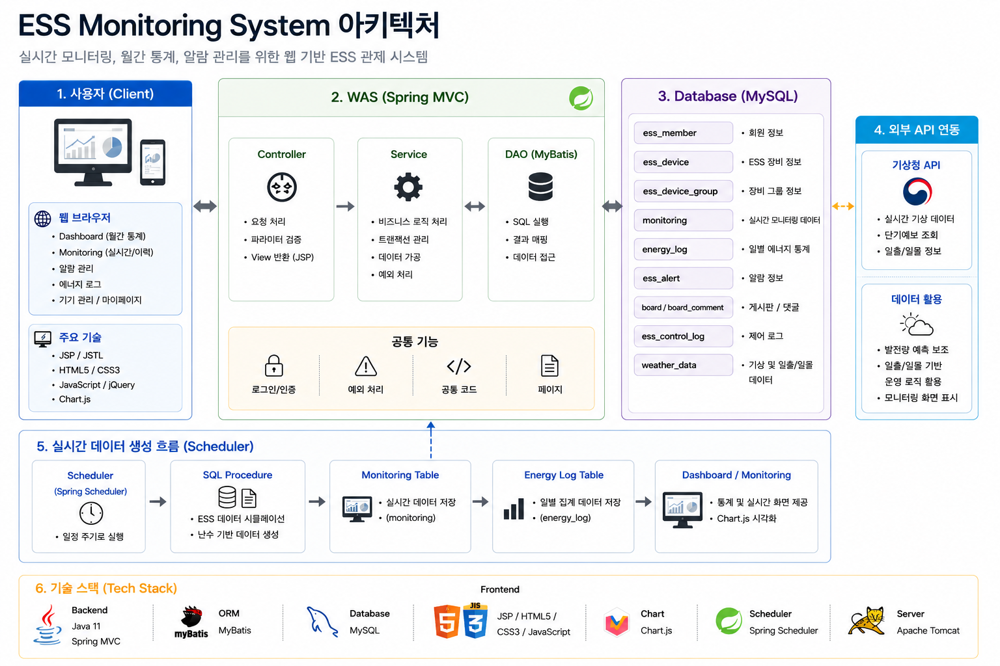
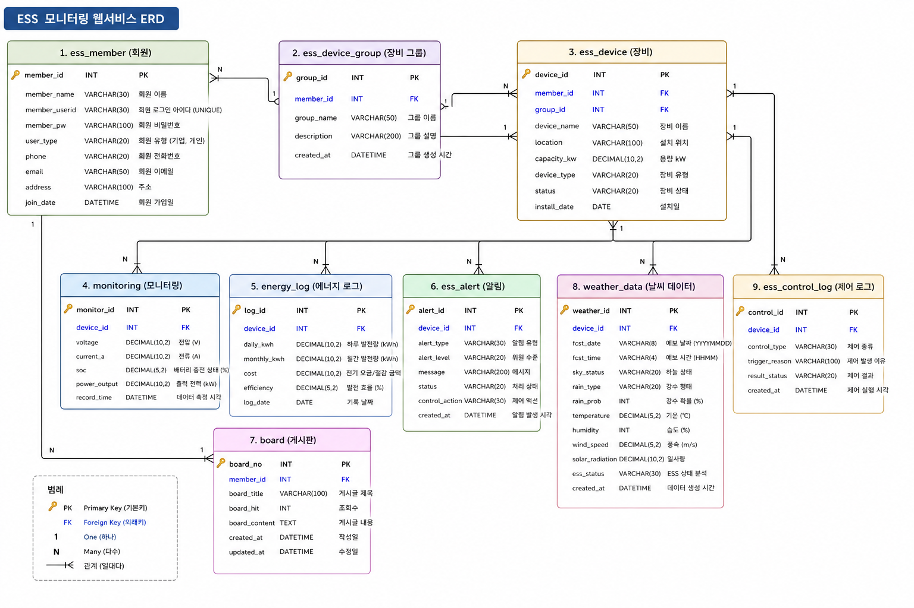
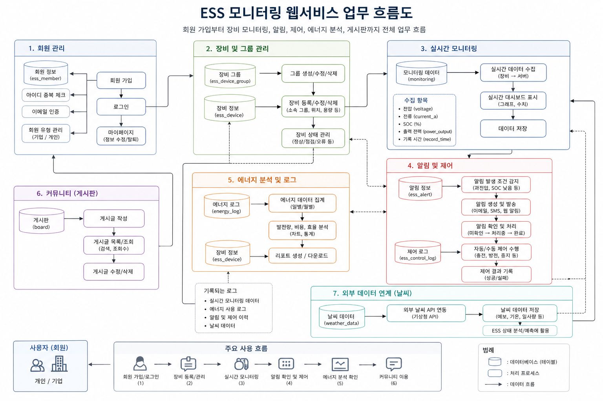

# ESS Monitoring System Refactoring

Spring Legacy 기반 ESS 모니터링 프로젝트를 개인적으로 리팩토링 및 유지보수한 프로젝트입니다.

기존 학원 팀 프로젝트를 기반으로 단순 기능 구현 중심 구조를 개선하고, 실제 운영형 ESS 관제 시스템에 가깝도록 데이터 구조, 화면 구조, 시뮬레이션 로직, 대시보드 통계 기능을 재정리했습니다.

---

## 📌 Portfolio

* [Notion Portfolio](https://app.notion.com/p/ESS-Monitoring-refactor-44d846e61ed383e98ffc81ff73ec2f99?source=copy_link)

---

## 🏗 System Architecture



---

## 1. 프로젝트 소개

ESS Monitoring System은 태양광 발전 설비와 ESS 배터리 상태를 모니터링하는 웹 기반 시스템입니다.

기존 프로젝트는 장비 등록, 게시판, 모니터링 화면 중심으로 구성되어 있었으나, 개인 리팩토링 과정에서 다음과 같은 방향으로 개선했습니다.

* 실시간 모니터링 데이터 구조 개선
* 대시보드 통계 구조 재설계
* Spring Scheduler 기반 데이터 자동 생성
* SQL Procedure 기반 시연 데이터 자동 생성
* ESS 운영 흐름 기반 시뮬레이션 로직 추가
* SOC 기반 상태 판단 및 Alert 생성
* Chart.js 기반 시각화 개선
* 기상청 API 기반 날씨 / 일출 / 일몰 데이터 활용
* 그룹 / 장비 / 날짜 / 월 기준 조회 구조 적용
* 논리 삭제 구조 추가
* 화면 디자인 통일
* 로그인 실패 알림 분기 처리
* SQL / 문서 / 프로젝트 디렉토리 구조 정리

---

## 2. 핵심 개선 방향

기존 프로젝트는 실시간 운영 데이터와 통계 데이터의 역할이 명확히 분리되어 있지 않았습니다.

이번 리팩토링에서는 다음과 같이 역할을 분리했습니다.

```txt
Dashboard Main
→ energy_log 기반 월별 / 일별 통계 화면

상세 Monitoring
→ monitoring 기반 실시간 운영 데이터 화면
```

이를 통해 대시보드는 장기 통계 중심으로, 상세 모니터링은 실시간 운영 상태 중심으로 구성했습니다.

---

## 3. 주요 기능

### 3.1 ESS 실시간 상세 모니터링

* 장비별 실시간 운영 상태 조회
* 실시간 출력(kW), SOC(%), 전압 / 전류 조회
* 금일 발전량 및 절감 금액 조회
* 시간별 출력 / SOC / 발전량 그래프 제공
* 최근 7일 발전량 및 절감 금액 차트 제공
* 최근 Alert 조회
* 운영 판단 요약 제공
* 오늘 날짜 기준 자동 갱신
* 과거 날짜 선택 시 이력 조회 모드 전환

### 3.2 Dashboard Main 통계 화면

* 선택 월 기준 발전량 합계 조회
* 선택 월 기준 절감 금액 합계 조회
* 월간 평균 효율 조회
* 운영 장비 수 조회
* 최근 6개월 발전량 / 절감 금액 차트
* 장비별 발전량 TOP 5 차트
* 최근 알림 조회
* 대표 지역 날씨 정보 조회
* 그룹 / 장비 / 월 기준 필터링

### 3.3 Spring Scheduler 기반 실시간 데이터 생성

```txt
Spring Scheduler 실행
→ 활성 장비 목록 조회
→ 기상청 API / 장비 정보 기반 운영 데이터 생성
→ monitoring 저장
→ energy_log 누적
→ 장비 상태 갱신
→ Alert 발생 여부 판단
```

실제 ESS 장비가 없는 개발 환경에서 운영 화면을 검증하기 위해, Spring Scheduler를 통해 현재 시각 기준 모니터링 데이터를 지속적으로 생성하도록 구성했습니다.

### 3.4 SQL Procedure 기반 시연 데이터 생성

```txt
seed_busan_demo_data.sql 실행
→ 시연용 회원 / 그룹 / 장비 생성
→ 최근 6개월 energy_log 생성
→ 최근 6개월 monitoring 생성
→ 오늘 데이터는 현재 시각 직전까지만 생성
→ 이후 데이터는 Spring Scheduler가 이어서 생성
```

SQL Procedure는 실시간 운영 로직이 아니라, 포트폴리오 시연 및 테스트 환경 구축을 위한 초기 데이터 생성 용도로 사용했습니다.

---

## 4. ESS 운영 시뮬레이션 구조

```txt
태양광 발전량 생성
→ 사용 전력량 차감
→ 남는 전력 ESS 충전
→ 현재 배터리 잔량 갱신
→ SOC 계산
→ 상태 판단
→ Alert 발생
```

```txt
발전량 > 사용량
→ 충전 증가 / SOC 상승

발전량 < 사용량
→ 방전 진행 / SOC 감소
```

---

## 5. Alert 처리 구조

```txt
SOC <= 10
→ ERROR / CRITICAL Alert

SOC <= 25
→ WARNING Alert

주간 시간대 출력 저하
→ POWER_LOW Alert
```

중복 Alert 방지 로직:

```txt
최근 10분 내 동일 장비 / 동일 유형 / 미처리 Alert 존재
→ 신규 Alert 생성 방지
```

---

## 6. 기술 스택

| Category        | Stack                              |
| --------------- | ---------------------------------- |
| Backend         | Java 11, Spring Legacy, Spring MVC |
| Database        | MySQL / MariaDB                    |
| ORM             | MyBatis                            |
| Frontend        | JSP, JSTL, JavaScript, jQuery      |
| Chart           | Chart.js                           |
| API             | 기상청 Open API                       |
| Build Tool      | Maven                              |
| Server          | Apache Tomcat                      |
| Version Control | Git, GitHub                        |
| IDE             | STS / Eclipse                      |

---

## 7. 기술적으로 강조할 수 있는 부분

* 단순 CRUD가 아니라 외부 API 연동, 파일 업로드, 데이터 파싱, 실시간 모니터링 구조까지 직접 구현했습니다.
* Spring XML 설정, Bean 등록, MyBatis 연동 과정에서 발생하는 의존성 충돌 및 빌드 문제를 직접 해결했습니다.
* `monitoring`과 `energy_log`를 분리하여 실시간 운영 데이터와 통계 데이터를 목적에 맞게 관리했습니다.
* Spring Scheduler 기반 데이터 자동 생성 구조를 구현하여 실제 센서 데이터가 없는 환경에서도 운영 흐름을 시뮬레이션할 수 있도록 구성했습니다.
* SQL Procedure를 활용하여 6개월치 시연 데이터를 자동 생성하고, 테스트 환경을 빠르게 재구성할 수 있도록 했습니다.
* ESS 충전 / 방전 흐름과 SOC 변화를 연결하여 단순 랜덤 데이터가 아닌 운영 흐름 기반 시뮬레이션 구조를 구현했습니다.
* 기상청 API를 활용하여 날씨, 일출 / 일몰 데이터를 수집하고 대시보드에 활용했습니다.
* 논리 삭제 구조를 적용하여 운영 데이터 이력 보존과 유지보수성을 고려했습니다.

---

## 8. 데이터 구조

### monitoring

실시간 운영 데이터 저장 테이블입니다.

* 전압
* 전류
* SOC
* 출력
* 발전량
* 충전량
* 사용량
* 절감 금액
* 측정 시간

### energy_log

일별 / 월별 통계 데이터 저장 테이블입니다.

* 일일 발전량
* 월간 발전량
* 절감 금액
* 운영 효율
* 기록 날짜

### weather_data

기상청 API 기반 날씨 데이터 저장 테이블입니다.

* 기온
* 습도
* 풍속
* 강수확률
* 일출 시간
* 일몰 시간
* 날씨 기반 ESS 상태 분석

---

## 9. 화면 및 산출물

### ERD



### 업무 흐름도



---

## 10. 프로젝트 구조

```txt
ess-monitoring-refactor/
│
├── backend/
│   └── ess_monitoring/
│       ├── src/main/java/
│       │   └── com/lgy/ess_monitoring/
│       │       ├── controller/
│       │       ├── service/
│       │       ├── dao/
│       │       ├── dto/
│       │       └── scheduler/
│       │
│       ├── src/main/resources/
│       │   └── mapper/
│       │
│       └── src/main/webapp/
│           ├── WEB-INF/views/
│           └── resources/
│               ├── css/
│               ├── js/
│               └── img/
│
├── sql/
│   ├── schema/
│   │   └── create_tables.sql
│   ├── data/
│   │   └── seed_busan_demo_data.sql
│   └── query/
│       └── performance_test_query.sql
│
├── docs/
└── publishing/
```

---

## 11. 실행 환경

* Java 11
* Spring Legacy
* Maven
* Tomcat
* MySQL / MariaDB
* STS / Eclipse

---

## 12. 실행 방법

### 1. 프로젝트 Import

STS 또는 Eclipse에서 Maven Project로 import합니다.

### 2. DB 생성

```sql
CREATE DATABASE ess_monitoring;
USE ess_monitoring;
```

### 3. 테이블 생성

```txt
sql/schema/create_tables.sql 실행
```

### 4. 시연용 데이터 생성

```txt
sql/data/seed_busan_demo_data.sql 실행
```

해당 SQL은 Procedure를 생성한 뒤 `CALL seed_busan_demo_data();`를 실행하여 시연용 데이터를 자동 생성합니다.

생성되는 데이터는 다음과 같습니다.

```txt
- company / admin 계정
- 부산 ESS 그룹 2개
- ESS 장비 8대
- 최근 6개월 energy_log
- 최근 6개월 monitoring
- 오늘 날짜 데이터는 현재 시각 직전까지만 생성
- 최근 7일 weather_data
- Alert / 게시판 / 댓글 시연 데이터
```

### 5. Scheduler 실행 모드 확인

시연용 데이터 실행 후에는 Scheduler가 현재 시각 이후의 데이터를 자연스럽게 이어서 생성해야 합니다.

따라서 배터리 방전 테스트용 모드가 켜져 있다면 끄고, 일반 운영 모드로 실행합니다.

```java
// 테스트용 방전 모드
private static final boolean DEMO_DRAIN_MODE = false;

// 일반 발전 시뮬레이션 모드
private static final boolean DEMO_DAY_MODE = true;
```

정리하면 다음 상태로 실행하는 것을 권장합니다.

```txt
DEMO_DRAIN_MODE = false
DEMO_DAY_MODE = true
```

`DEMO_DRAIN_MODE`가 `true`이면 SOC가 빠르게 감소하여 WARNING / ERROR 상태가 강제로 발생할 수 있으므로, 일반 시연에서는 `false`로 설정합니다.

### 6. Tomcat 실행

Tomcat 서버 연결 후 `Run on Server`로 실행합니다.

실행 후 Spring Scheduler가 주기적으로 monitoring 데이터를 추가 생성합니다.

### 7. 성능 테스트 쿼리

성능 비교용 쿼리는 필수 실행 파일이 아닙니다.

```txt
sql/query/performance_test_query.sql
```

해당 파일은 조회 방식 비교 및 성능 개선 설명용으로만 사용합니다.

---

## 13. 브랜치 전략

```txt
main
 └── develop
      ├── feature/*
      ├── refactor/*
      ├── fix/*
      └── docs/*
```

| Branch     | Role      |
| ---------- | --------- |
| main       | 안정 버전 관리  |
| develop    | 작업 통합 브랜치 |
| feature/*  | 신규 기능 작업  |
| refactor/* | 리팩토링 작업   |
| fix/*      | 버그 수정     |
| docs/*     | 문서 수정     |

---

## 14. Commit Convention

```txt
feat: 기능 추가
fix: 버그 수정
refactor: 코드 리팩토링
docs: 문서 수정
chore: 기타 작업
```

---

## 15. 개선 예정

* 예외 처리 공통화
* API 응답 구조 표준화
* 테스트 코드 추가
* SQL 성능 최적화
* Spring Boot 전환 검토
* 운영 로그 구조 개선
* Alert 처리 상태 관리 개선
* 관리자 화면 기능 확장
